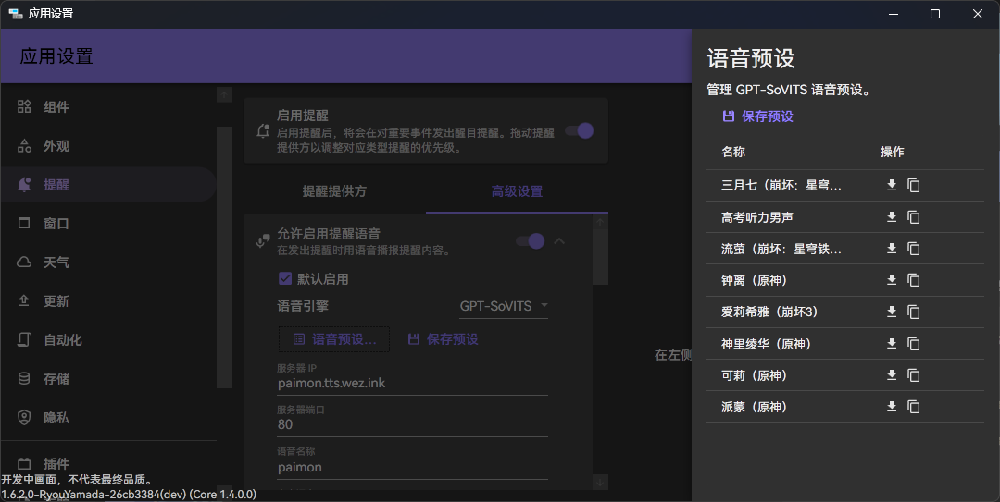
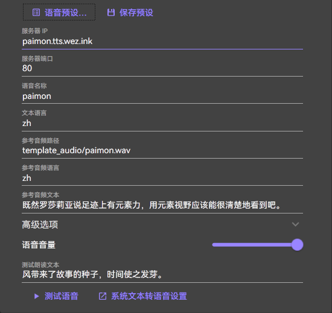

# 提醒

::: note
如果您想了解如何开发提醒，请参考[开发文档](../dev/notifications/index.md)。
:::

应用在一些特定时间点会发出醒目提醒。如会在上课前指定的时间发出上课准备提醒，及在下课时发出提醒并预告下节课程。（如下图）

您可以点击主菜单中【清除所有提醒】按钮来清除当前显示的提醒（如图）。

## 提醒设置

您可以在[【设置】->【提醒】](classisland://app/settings/notification)中调整相关提醒的设置。

## 提醒优先级

在发出提醒时，应用会按照提醒提供方列表中的排序，优先展示来自靠前的提醒提供方的提醒。

## 强调提醒

在发出提醒时，ClassIsland 会全屏播放提醒特效，并且可以播放提示音效，增强提醒效果，置顶 ClassIsland 主界面。提醒音效默认禁用，您可以自定义要播放的提示音效。您还可以给每个提醒来源单独设置音效。

您可以在[【设置】->【提醒】->【高级设置】](classisland://app/settings/notification)调整相关设置。

您也可以为每个提醒提供方设置单独的设置。设置时需要启用【对此提醒来源启用特殊高级设置】。这些设置会按照【在设置界面为每个提醒提供方设置】->【提醒提供方在发送提醒时要求的设置】->【全局设置】的顺序应用。

## 朗读提醒内容

在发出提醒时，ClassIsland 可以大声读出提醒的内容。此功能默认禁用，您可以前往[【设置】->【提醒】->【高级设置】](classisland://app/settings/notification)调整相关设置。

### GPT-SoVITS服务

> [!tip] 
> 此功能在1.6.0.0及以上版本中可用。

您可以十分便利地使用 ClassIsland 官方提供的公共TTS服务，您可以在【语音预设】按钮中找到预设的语音服务。

您可以在[ClassIsland 服务状态](https://status.classisland.tech/)查看TTS服务的运行状态。

#### 自建GPT-SoVITS服务

> [!warning]
> GPT-SoVITS 并不是 ClassIsland 官方服务， ClassIsland 不提供任何技术支持，也不为此服务的安全性和可用性作任何保证。
> 
> 接下来的内容可能较困难，请自行评估自建TTS服务的可行性与必要性。
>
> 下面的内容根据 [20250228v3](https://github.com/RVC-Boss/GPT-SoVITS/releases/tag/20250228v3) 版本编写，不保证在后续更新中可用。

建议配置：一张至少4G显存的显卡。CPU推理的速度可能难以接受。您也可以购买云服务来搭建TTS，详见教程。

详细教程请查看 GPT-SoVITS 官方维护的 [GPT-SoVITS指南](https://www.yuque.com/baicaigongchang1145haoyuangong/ib3g1e)

在准备好 GPT-SoVITS 的设备与模型之后，请先在服务根目录下的`config.py`填写好您将会使用的SoVITS模型和GPT模型路径，以及服务端口。然后在合适的地方放置好参考音频路径。运行服务根目录下的`api_v2.py`，服务端配置结束。

> [!tip]
> 如果您使用过 web ui 中的"打开推理界面"功能，`api_v2.py`将会优先使用`GPT-SoVITS/configs/tts_infer.yaml`中的配置，您可以将其删除或是修改。

按照需要在 ClassIsland 中填写相应的配置项，其中【语音名称】用于将不同模型的缓存文件区分开，您可以填写一个独特的名称以确保缓存文件不会走错地方。

最后，使用【测试朗读文本】对配置进行测试。您可以在日志中看到运行的状态。如果不成功，您可以使用日志中生成的 URL 粘贴进浏览器进行调试。
