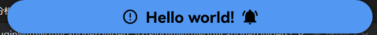
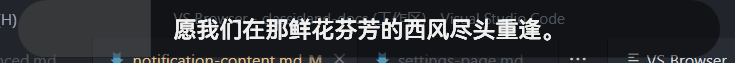
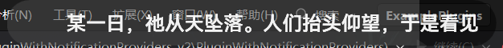

# 提醒内容

本文主要讲述了如何更深入地自定义提醒内容。阅读本章节前请先阅读章节[提醒](./index.md)，以建立对提醒系统的基本了解。

提醒内容 [`NotificationContent`](https://api.docs.classisland.tech/api/ClassIsland.Core.Models.Notification.NotificationContent.html) 对应了提醒对应部分（比如遮罩、正文等）的内容信息，指定了这部分显示的内容、显示时长和朗读内容等信息。同时 ClassIsland 也内置了一些[提醒内容模板](#提醒内容模板)，便于快速显示较为简单的提醒内容。

提醒内容具有以下属性：

| 属性名 | 类型 | 必填？ | 说明 |
| -- | -- | -- | -- |
| Content | `object?` | **是** | 提醒内容。 |
| ContentTemplate | `DataTemplate?` | 否 | 提醒内容模板，可选。如果此值不为 null，将在呈现提醒内容 Content 时使用。 |
| Duration | `TimeSpan` | 否 | 此部分的显示时长。当 EndTime 不为 null 时，此项不起作用。 |
| EndTime | `TimeSpan` | 否 | 此部分显示的结束时间。|
| IsSpeechEnabled | `bool` | 否 | 显示此部分的提醒时是否启用语音。|
| SpeechContent | `string` | 否 | 显示此部分提醒时的语音内容。|

您可以阅读 API 参考文档[`NotificationContent` 类]来了解关于[`NotificationContent` 类]的更多信息。

## 内容

您可以通过设置[Content 属性]和[ContentTemplate 属性]来自定义提醒内容最终展示到主界面上的内容。

其中[Content 属性]可以直接指定显示的内容。如果属性设置为视觉元素（如用户控件等），那么这个视觉元素就会在显示到对应的提醒部分时直接显示在主界面上。您可以在实例化[`NotificationContent` 类]时直接将属性内容传入到参数中，例如：

``` csharp
ShowNotification(new NotificationRequest() {
    MaskContent = new NotificationContent(content)
});
// 上下两种写法是等价的
ShowNotification(new NotificationRequest() {
    MaskContent = new NotificationContent() {
        Content = content
    }
});
```

如果您要显示的内容比较复杂，可以将这些内容封装到一个用户控件中，然后再将其实例传入到这个属性上，例如：

``` csharp
ShowNotification(new NotificationRequest() {
    MaskContent = new NotificationContent(new MyContentControl(data))
});
```

您也可以通过在全局资源中为显示的提醒内容数据类型[创建数据模板](https://learn.microsoft.com/zh-cn/dotnet/desktop/wpf/data/data-templating-overview)，这样在显示这种类型的数据时就会自动使用指定的数据模板。您也可以通过设定[ContentTemplate 属性]手动指定特定的数据模板。

## 显示时长

您可以直接通过设置[Duration 属性]来指定提醒显示时长。如果您希望提醒在某个特定的时间点结束，可以设置[EndTime 属性]。这样会在显示这个提醒时动态计算显示这部分内容的实际时长，并覆盖原来的[Duration 属性]。

## 语音

您可以设置[SpeechContent 属性]来设置显示这部分提醒时朗读的内容，也可以设置[IsSpeechEnabled 属性]来禁用这部分提醒内容的语音播报功能。

> [!warning]
> 超出提醒总显示时长的语音将被截断。

## 提醒内容模板

ClassIsland 内置了以下提醒内容模板，可以在显示提醒时通过对应的方法调用。这些提醒内容模板可以通过[`NotificationContent` 类]中对应的静态方法调用，具体的参数信息可以通过点击 _调用方法_ 列的链接查看。

| 名称 | 类别 | 调用方法 | 截图 |
| --- | --- | --- | --- |
| 双图标提醒遮罩 | 遮罩 | [CreateTwoIconsMask](https://api.docs.classisland.tech/api/ClassIsland.Core.Models.Notification.NotificationContent.html#ClassIsland_Core_Models_Notification_NotificationContent_CreateTwoIconsMask_System_String_MaterialDesignThemes_Wpf_PackIconKind_MaterialDesignThemes_Wpf_PackIconKind_System_Boolean_System_Action_ClassIsland_Core_Models_Notification_NotificationContent__) |  |
| 简单文本 | 正文 | [CreateSimpleTextContent](https://api.docs.classisland.tech/api/ClassIsland.Core.Models.Notification.NotificationContent.html#ClassIsland_Core_Models_Notification_NotificationContent_CreateSimpleTextContent_System_String_System_Action_ClassIsland_Core_Models_Notification_NotificationContent__) |  |
| 滚动文本 | 正文 | [CreateRollingTextContent](https://api.docs.classisland.tech/api/ClassIsland.Core.Models.Notification.NotificationContent.html#ClassIsland_Core_Models_Notification_NotificationContent_CreateRollingTextContent_System_String_System_Nullable_System_TimeSpan__System_Int32_System_Action_ClassIsland_Core_Models_Notification_NotificationContent__) |  |

其中每种模板的调用方法均包含 `factory` 参数，用于在从模板创建提醒内容后修改提醒内容的信息（如时长等）。`factory` 接受一个 `Action<NotificationContent>` 类型的方法，其中第一个参数为创建好的提醒内容，例如：

``` csharp
ShowNotification(new NotificationContent() {
    MaskContent = NotificationContent.CreateTwoIconsMask("遮罩文本", factory: x => {
            // 这里的参数 x 就是创建好的提醒内容，可以在这里对提醒内容进行定制。
            x.Duration = TimeSpan.FromSeconds(3);
        })
    });
```

[`NotificationContent` 类]: https://api.docs.classisland.tech/api/ClassIsland.Core.Models.Notification.NotificationContent.html
[Content 属性]: https://api.docs.classisland.tech/api/ClassIsland.Core.Models.Notification.NotificationContent.html#ClassIsland_Core_Models_Notification_NotificationContent_Content
[ContentTemplate 属性]: https://api.docs.classisland.tech/api/ClassIsland.Core.Models.Notification.NotificationContent.html#ClassIsland_Core_Models_Notification_NotificationContent_ContentTemplate
[Duration 属性]: https://api.docs.classisland.tech/api/ClassIsland.Core.Models.Notification.NotificationContent.html#ClassIsland_Core_Models_Notification_NotificationContent_Duration
[EndTime 属性]: https://api.docs.classisland.tech/api/ClassIsland.Core.Models.Notification.NotificationContent.html#ClassIsland_Core_Models_Notification_NotificationContent_EndTime
[SpeechContent 属性]: https://api.docs.classisland.tech/api/ClassIsland.Core.Models.Notification.NotificationContent.html#ClassIsland_Core_Models_Notification_NotificationContent_SpeechContent
[IsSpeechEnabled 属性]: https://api.docs.classisland.tech/api/ClassIsland.Core.Models.Notification.NotificationContent.html#ClassIsland_Core_Models_Notification_NotificationContent_IsSpeechEnabled
