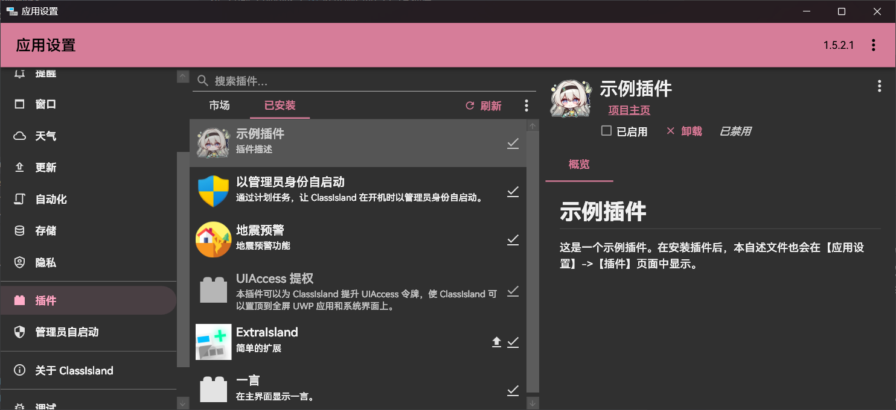

# 插件

插件可以在不修改 ClassIsland 应用本体的情况下，轻易地扩展 ClassIsland 的功能，比如添加自定义组件、显示自定义提醒等等。同时也可以与跨进程联动配合，从其他进程调用插件功能。制作好的插件可以通过[上架到插件市场](./publishing.md)等方式，与其他用户共享。

## 开始编写插件

您可以通过阅读文章[开始编写插件](create-project.md)来了解如何开发插件。

如果您想要以开发插件的形式对 ClassIsland 生态进行贡献，但不知道要做什么时，[插件功能请求板块](https://github.com/ClassIsland/ClassIsland/discussions/categories/%E6%8F%92%E4%BB%B6%E5%8A%9F%E8%83%BD%E8%AF%B7%E6%B1%82)是一个很好的寻找灵感的地方。
