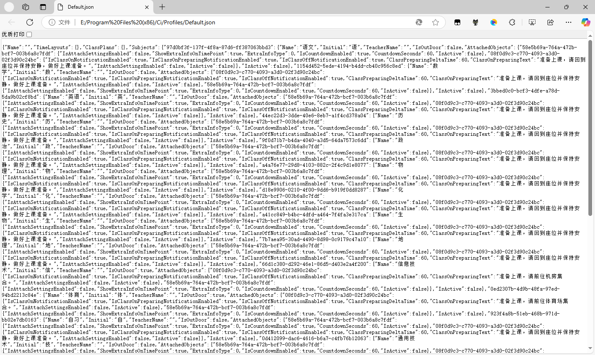
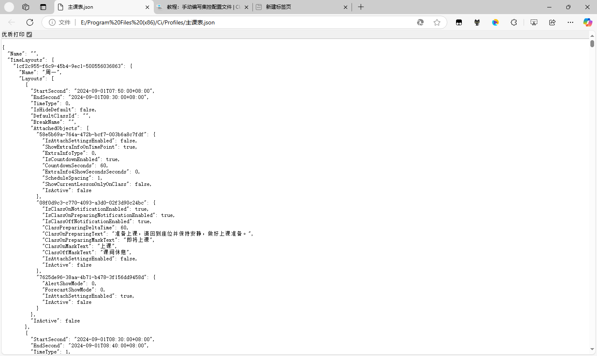
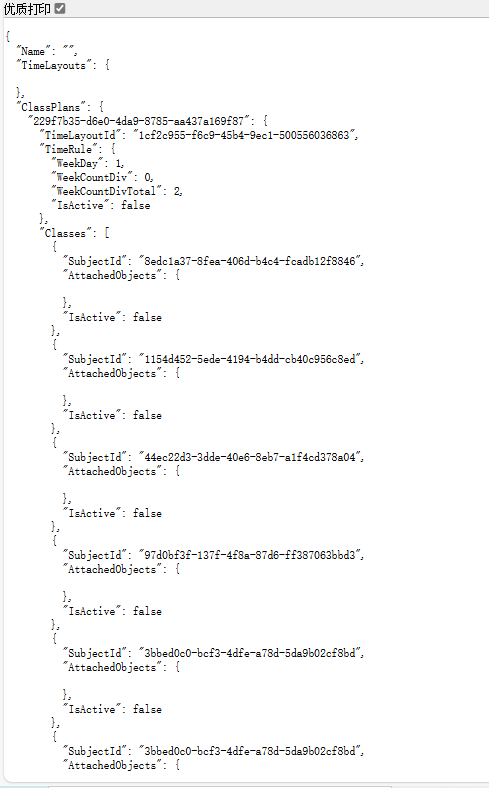
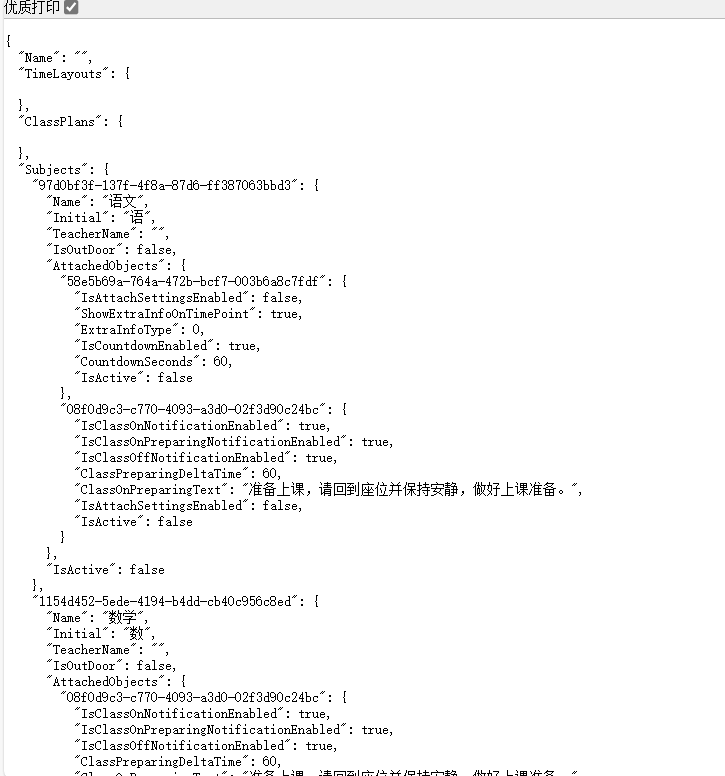
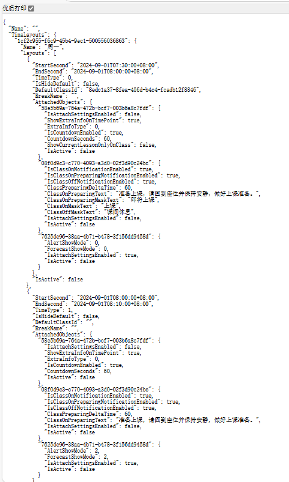

# 教程：拆分集控配置文件

本教程将指引您手动拆分集控配置文件。

每当你看见👉️符号，就说明你应该做一些事情。而其余的只供您参考和更深入的理解。

## 在开始之前

我们需要在本地安装一个 ClassIsland 实例并编写好您的档案。您可以参考[这篇文档](/app/profile/)编写档案。

**👉️按照指示[下载并安装 ClassIsland 本体](https://github.com/HelloWRC/ClassIsland?tab=readme-ov-file#%E5%BC%80%E5%A7%8B%E4%BD%BF%E7%94%A8)。**

**👉️按照指示[编写档案](/app/profile/)。**

**👉️获取编写好的 ClassIsland 档案。**

**👉️确保您已经安装了文本编辑器，如 Visual Studio Code，用于编辑 JSON 文件,本教程以 `Visual Studio Code` 为例。**

ClassIsland 档案存放在 ClassIsland 目录下的 `Profiles` 文件夹中。
ClassIsland 默认档案名称为 `Default.json`,您也可以使用您自定义的档案名称。

## 拆分档案

👉️打开一款任意的 `Chrome` ,本教程以 `Microsoft Edge` 浏览器为例。

👉️将 `Default.json` 拖入 `Microsoft Edge` 浏览器



👉️点击左上角的 `优质打印` 按钮



### 拆分出 TimeLayouts.json
👉️在 `Microsoft Edge` 中，复制 `Default.json` 文件中的 `TimeLayouts` 部分。

👉️在 `Visual Studio Code` 创建一个新的文件，命名为 `TimeLayouts.json`。

👉️将以下模板粘贴到 `TimeLayouts.json` 文件中：

```json:TimeLayouts.json
{
    "Name": "",
    "TimeLayouts": {
       // 粘贴从 Default.json 中复制的 TimeLayouts内容
    },
    "ClassPlans": {},
    "Subjects": {}
} 
```

### 拆分出 ClassPlans.json

👉️在 `Microsoft Edge` 中，复制 Default.json 文件中的 ClassPlans 部分。

👉️在 `Visual Studio Code` 创建一个新的文件，命名为 ClassPlans.json。

👉️将以下模板粘贴到 ClassPlans.json 文件中：

```json:ClassPlans.json
{
    "Name": "",
    "TimeLayouts": {},
    "ClassPlans": {
        // 粘贴从 Default.json 中复制的 ClassPlans 内容
    },
    "Subjects": {}
}
```

👉️将复制的 ClassPlans 内容粘贴到 ClassPlans.json 文件中的 ClassPlans 字段内。 

👉️保存 ClassPlans.json 文件。

### 拆分出 Subjects.json

👉️在 `Microsoft Edge` 中，复制 Default.json 文件中的 Subjects 部分。

👉️在 `Visual Studio Code` 创建一个新的文件，命名为 Subjects.json。

👉️将以下模板粘贴到 Subjects.json 文件中：

```json:Subjects.json
{
    "Name": "",
    "TimeLayouts": {},
    "ClassPlans": {},
    "Subjects": {
        // 粘贴从 Default.json 中复制的 Subjects 内容
    }
}
```

👉️将复制的 Subjects 内容粘贴到 Subjects.json 文件中的 Subjects 字段内。 

👉️保存 Subjects.json 文件。

正确拆分截图：
`classPlan.json`文件



`Subjects.json`文件



`TimeLayouts.json`文件




## 结语

🎉恭喜！您现在已经对拆分集控文件有了初步的认识。您可以进一步研究[集控文档](tutorial-create-management-config.md#拉取档案)，来更深入地了解编写集控配置的方法。

